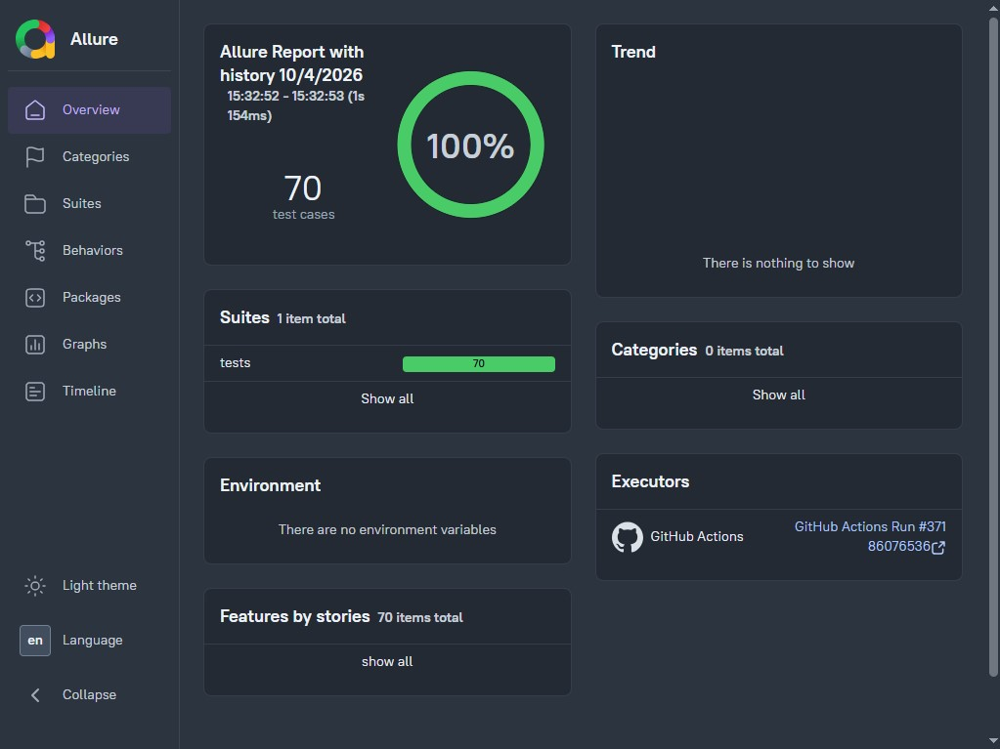
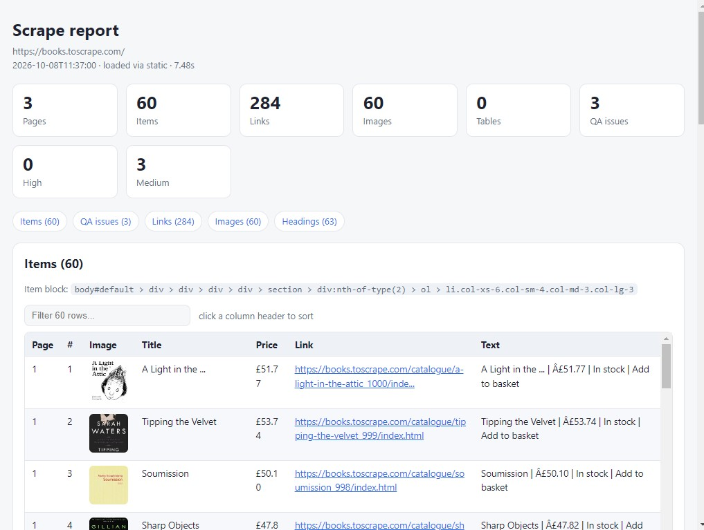

# Tendem Scraper — Production POM Web-Scraping Framework

**One CLI. Every scraping workflow.** Static pages, JavaScript SPAs, infinite
scroll, whole-site crawls, authenticated sessions, CMS auto-detection,
concurrency, resume, dedupe, multi-format delivery, and a self-contained
HTML report — all in one Python package with a 5-job CI pipeline and live
Allure test report.

[](https://github.com/pranromumu/tendem-scraper/actions/workflows/ci.yml)
[](https://pranromumu.github.io/tendem-scraper/)
[](https://www.python.org/downloads/)
[](https://playwright.dev/python/)
[]()
[]()
[](LICENSE)
[](https://github.com/astral-sh/ruff)

---

## 📸 Live artifacts

| Artifact | Link |
|---|---|
| **Live Allure report** (auto-published on every push to `main`) | https://pranromumu.github.io/tendem-scraper/ |
| **CI pipeline** (5-job quality gate) | https://github.com/pranromumu/tendem-scraper/actions/workflows/ci.yml |
| **Scrape report example** | See `docs/scrape-report-screenshot.png` |





---

## ⚡ 30-second demo

```bash
# install
pip install -e ".[dev,cloud,llm]"
playwright install chromium

# 1) just paste a URL — auto-detects the CMS and the repeating card
tendem-scrape https://books.toscrape.com/ --max-pages 3 --open

# 2) whole-site crawl: concurrency + dedupe + multi-format
tendem-scrape https://books.toscrape.com/ --crawl --crawl-max 40 --concurrency 8 \
    --dedupe --format csv,json,jsonl,sqlite --open

# 3) log in ONCE, reuse the session headlessly forever after
tendem-scrape https://site.com/login --interactive --save-session mysite
tendem-scrape https://site.com/orders --use-session mysite --max-pages 10